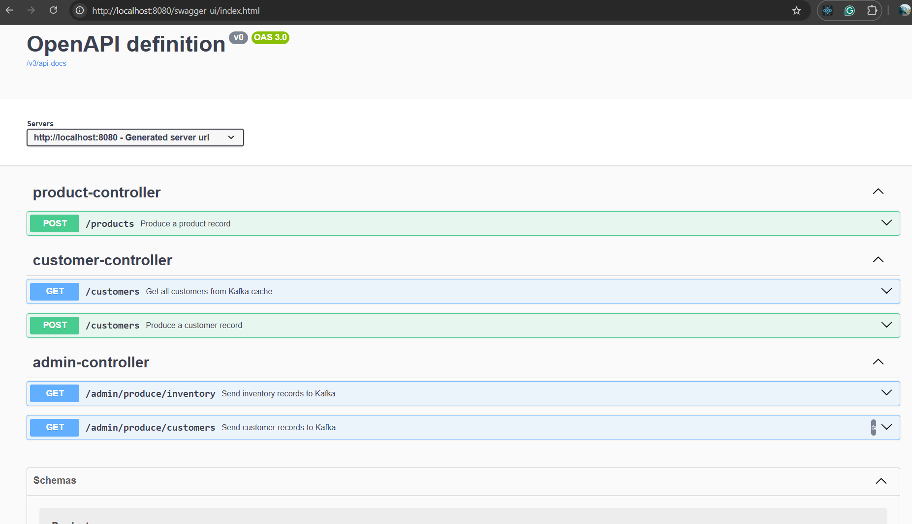
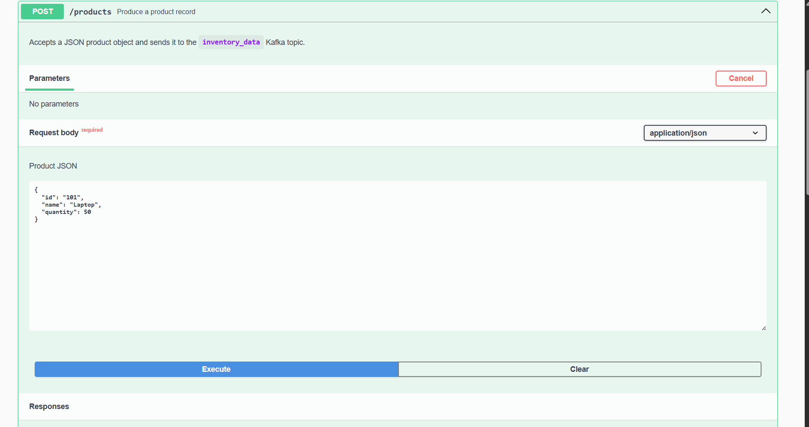
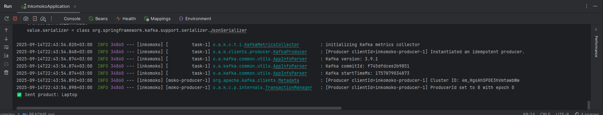

# Inkomoko Spring Boot Kafka Integration

A Spring Boot application demonstrating Kafka producers and consumers for customer and inventory data, using Docker to run Kafka and Zookeeper.

---

## Features

- REST API to produce customer data to Kafka:
    - `POST /customers` — sends a JSON payload to the `customer_data` Kafka topic.
- REST API to produce inventory data to Kafka:
    - `POST /inventory` — sends a JSON payload to the `inventory_data` Kafka topic.
- Kafka consumers (Python) listen to topics and persist messages to a database.
- Reliable processing with deduplication and analytics forwarding.
- Dockerized Kafka and Zookeeper setup for local development.
- Unit tests with mocking frameworks for both Java producers and Python consumers.

---

## Tech Stack

- Java 17+
- Spring Boot 3.x
- Kafka 3.8 (via Docker)
- Python 3.11 (for consumers)
- SQLAlchemy + PostgreSQL
- IntelliJ IDEA
- Docker

---

## Prerequisites

- Java JDK 17+
- Maven
- Docker & Docker Compose
- Python 3.11 (for running consumers)
- PostgreSQL database (for persistence)

---

## Getting Started

### 1. Clone the Repository

```bash
git clone <Link>
cd inkomoko-springboot

```
### 2. Start Kafka

```
docker-compose up -d

```

### 3. Start SpringBoot

```
mvn clean install
mvn spring-boot:run
```
### 4. Testing ApI's with Swagger






